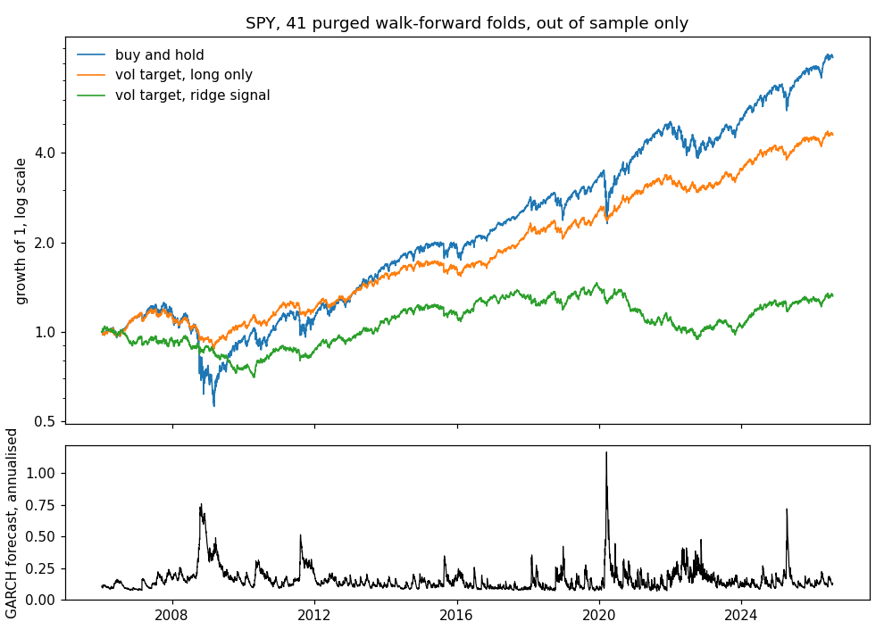

# walkforward

> Volatility forecasts that have not seen the period they forecast, position sizes built from them, and walk-forward splits whose training labels cannot reach into the test window. A C11 core with a numpy front door.

[](https://github.com/haeganm/walkforward/actions/workflows/ci.yml)
[](https://pypi.org/project/walkforward/)
[](https://en.wikipedia.org/wiki/C11_(C_standard_revision))
[](LICENSE)

Most backtests that look good are quietly peeking one bar ahead. The estimator that sizes a position already knows the return it is about to earn, or a training label was computed from prices inside the test window. Both are one line of ordinary-looking code. This library is built so neither can happen by accident.

- **One timing convention.** Every forecast at index `t` is built from data before `t`. EWMA and the GARCH filter both work this way, so a position sized from `sigma[t]` can be scored against `returns[t]`. Contemporaneous estimators say so in their own docstrings and come with `lag` to fix them. Tested by construction: recompute on a prefix, get the prefix, bit for bit.
- **Purging that asks the right question.** `PurgedWalkForward` takes a label horizon, not a purge count, because `purge = h - 1` is the part people get wrong. It drops into `cross_val_score`.
- **GARCH(1,1) by maximum likelihood** with no optimizer dependency, checked against the `arch` package on identical samples and identical likelihoods, and invariant to the units of the returns: a fit on returns scaled by 1e-8 gives the same alpha and beta as one scaled by 1e6.
- **Sizing that fails closed.** Volatility targeting with a notional cap, mean-variance Kelly, drawdown scaling. A bad price gives a zero position, never a NaN one. A leverage cap that would overflow is refused rather than silently ignored.
- **Rolling statistics in O(n)** that stay accurate at index levels (4.4e-16 at a price level of 1e9, where a plain two-pass computation is already off by 4.9e-12), along a trend from 100 to 1e6, and after a bad tick has left the window.
- **Ridge by Householder QR** on the centered design, so the intercept is unpenalized and accuracy stays at condition number times epsilon where the normal equations would square it.

The C builds as strict ISO C11 under GCC, Clang and MSVC with warnings as errors and no fused multiply-add, so results agree across compilers to the last bit. CI runs the suite on Linux (gcc and clang, 64- and 32-bit), macOS and Windows, under AddressSanitizer and UBSan, installs the library and consumes it through `find_package` and `pkg-config`, compiles the public headers as C++17, builds and tests the Python wheel on three platforms, and compares every function against pandas, numpy, scikit-learn and `arch`.

This is research software, not investment advice.

## Install

```bash
pip install walkforward
```

Wheels cover Linux x86-64 and aarch64, macOS Intel and Apple silicon, and Windows x64. Each carries its own compiled library and needs nothing but numpy at runtime. The C library on its own is [below](#the-c-library).

## The loop

```python
import walkforward as wf

# The fit assumes mean-zero returns. Demean with the TRAINING mean; the
# full-sample mean would put the future into the fit.
mu = returns[:1000].mean()
model = wf.garch_fit(returns[:1000] - mu)

# sigma[t] forecasts period t from returns before t. filter_from continues
# from the variance state the fit ended on, which is what makes the
# out-of-sample path identical to filtering everything together.
sigma = model.filter_from(returns[1000:] - mu)

# A position held over period t is entered at the close of t-1, so it is
# sized against the previous close, and earns position * price * return.
entry = close[999:-1]
position = wf.vol_target_position(
    sigma, target_vol=0.01, equity=100_000.0, price=entry, max_leverage=2.0
)
pnl = position * entry * returns[1000:]
```

`model.persistence`, `model.half_life` and `model.unconditional_vol` are there so you do not have to recompute them. A pandas Series in gives a pandas Series out, on the same index, because realigning a bare array by hand is one of the ways lookahead gets in. Two Series passed together must share an index, for the same reason: they are read by position, and `lag` is the way to shift one.

## Cross-validation

```python
from sklearn.ensemble import GradientBoostingRegressor
from sklearn.model_selection import cross_val_score
import walkforward as wf

# The target is a 21-period forward return, so labels span 21 periods and the
# last 20 training rows before each test window are dropped.
cv = wf.PurgedWalkForward(train_size=756, test_size=252, label_horizon=21)

scores = cross_val_score(GradientBoostingRegressor(), X, y, cv=cv)
```

Without the purge those twenty rows carry labels partly computed from test-window prices. The suite counts the leak directly: at a horizon of 21, a purge of 20 leaves zero leaking training rows and a purge of 19 leaves ten.

There is no `embargo` argument, on purpose. An embargo protects training data that sits after a test window, and a walk-forward never trains on anything after the window it is testing. `walk_forward_splits(..., include_post_train=True)` exposes that variant with the warning it deserves.

## A full walk-forward on SPY

[`examples/spy_walk_forward.ipynb`](examples/spy_walk_forward.ipynb) runs one model end to end on 25 years of daily SPY, checked in as `examples/data/SPY.csv` so it is reproducible offline. Six lagged features, a ridge regression on a five-day forward return, 41 purged walk-forward folds of five years in and half a year out, a GARCH(1,1) fitted per fold and continued onto the test window with `filter_from`, and a position targeting 10% annual volatility, sized against the previous close. Everything below is out of sample, 2006 to 2026.



| Strategy | Sharpe | Annual return | Annual vol | Max drawdown |
|---|---|---|---|---|
| Buy and hold | 0.63 | 12.2% | 19.3% | 55% |
| Vol target, long only | 0.79 | 7.9% | 10.1% | 27% |
| Vol target, ridge signal | 0.18 | 1.9% | 10.1% | 35% |

The sizing does what it says: realised volatility is 10.1% against a 10% target, and the long-only line beats buy and hold on Sharpe and halves the drawdown with nothing but variance forecasts. The ridge signal has no edge. Its hit rate is 53% and its correlation with the label is 0.04, and going with its sign costs 0.6 of Sharpe. That is the honest number for six textbook features on SPY.

Then the same model is run with one line changed each time, plus a control:

| Change | Sharpe |
|---|---|
| None | 0.18 |
| Purge nothing, as if the labels were one day long | 0.27 |
| Control: end every training window four bars earlier, leaking nothing | 0.10 |
| Drop every `lag`, so a feature for bar t includes bar t | 14.6 |

Skipping the purge moves the Sharpe by 0.08, and the control moves it by 0.08 the other way while changing the same number of training rows, so on this run the purge's effect is inside the noise of a single Sharpe. The leak it removes is real by construction and grows with the label horizon; it is small at five days against 1260 training rows. The last change is the one that matters. It produces a Sharpe of 14 from a model with no edge, and nothing in the code that produced it looks wrong. That is what the timing convention and `lag` exist to prevent.

## How it stays honest

**The forecast at t cannot see t.** `ewma_vol` emits the forecast before it absorbs `returns[t]`; the GARCH filter seeds from the model's stored backcast rather than from the series it is filtering, which is where the 2.x filter leaked. Both are tested for prefix stability (filtering the first half of a series gives the first half of the full filter, exactly) and for shock timing (a spike at bar k moves the output at k+1 and nothing before it). The reference suite goes further: for 40 random series it rewrites everything after a random `t` and asserts every output through `t` is bit-identical.

**The fitter is checked against something it did not write.** `arch` 7.2.0 fits the same simulated sample with the same backcast, so both sides maximize the same function. On the first reference sample walkforward reaches alpha 0.081035, beta 0.883501 and log-likelihood 9259.94908; `arch` reaches 0.081035, 0.883502 and 9259.94908. Across 20 fresh samples the largest parameter difference is 5e-7. `arch` needs the returns multiplied by 100 to converge on these samples; walkforward fits them raw, because its Nelder-Mead stops on simplex diameter as well as function value and its feasibility bound on omega is positivity rather than an absolute floor.

**The fitter is checked against brute force.** `tests/reference/garch_multistart_check.py` runs 78 Nelder-Mead starts on the identical likelihood over thirteen series built to be awkward: near-IGARCH, no ARCH effect, t(3) innovations, a 50-sigma outlier and a fourfold variance regime switch, each at n = 1500 and n = 100, plus SPY. A single start from the best grid point lost on three of them, by up to 1.7 log-likelihood units, which is why the fitter now runs several starts and restarts each until that stops helping. The last miss the script found was a 100-observation series with no ARCH effect, whose maximum sits at beta = 0: from any high-persistence seed the optimizer settled at alpha = 0 with beta near 1, 0.2 log-likelihood units short, and reported convergence. The grid now carries low-persistence seeds and one start is taken from them. The fit is within 3e-11 log-likelihood units of the brute-force optimum on all thirteen series. One consequence is worth knowing: on a series with one extreme tick the maximum of the likelihood is often an ARCH-like corner, alpha near 1 and beta near 0, and the fitter now finds and reports it, with `converged` set, where before it could stop at a worse local maximum. That is the estimate the model defines; winsorise the tick if it is not the one you want.

**The fit, the likelihood and the filter share one recursion step.** `omega + alpha*r*r + beta*s2` and `omega + alpha*(r*r) + beta*s2` differ by an ulp on about a third of steps, and when the fit computed `sigma2_next` one way and the filter stepped the other, the documented bit-exact continuation failed for 12% of fit samples by one ulp that then propagated. One step function now serves all three, checked on 60 seeds in the C suite and 60 more in the reference suite.

**Missing data does not poison state.** A NaN return leaves the forecast already made untouched and carries the recursion forward. A NaN inside a rolling window makes that window NaN and nothing else. A finite return whose square overflows is treated as missing rather than turning every later sigma into Inf.

**The API does not make the wrong thing easy.** In C, output arrays are `restrict`-qualified and documented as non-aliasing. In Python the binding allocates every output itself, so a numpy view cannot violate that contract at all. Continuing a fitted GARCH onto new data has its own entry point, because the plain filter on new data alone restarts from the backcast and is off by tens of percent for the first few dozen periods.

**The tests were tried against broken code, by hand.** Eleven deliberate breakages (drop the ridge term, drop the offset shift, drop each overflow guard, revert the optimizer criterion, revert the EWMA alignment) were compiled against the suite before 3.1.0; ten failed at least one assertion and the eleventh is unreachable through the public API. This was a one-off exercise, not a harness in the repository.

**Every function is fed garbage on every run.** A fuzz sweep runs 4000 rounds, 13 to 18 calls each, over the whole API with random sizes and contents (NaN, Inf, denormals, 1e308, negative zero, `SIZE_MAX` arguments) under AddressSanitizer and UBSan in CI, checking the promises rather than the numbers. Every fourth round is clean so the functions that demand finite input are reached on their success paths too; the first version of the sweep never once fitted a GARCH model, because an all-finite draw of a hundred values had probability 9e-6. Its findings so far: a denormal price made `equity / price` overflow past the leverage cap, and a hand-built model with omega near 1e308 made the filter emit Inf while reporting success. Both fail closed now.

## Conventions

Volatility is **per period** everywhere. Annualised converts as `annual / sqrt(periods_per_year)`, so a 10% annual target on daily data is `0.10 / sqrt(252)`, about 0.0063.

`rolling_std` uses population variance and divides by `window`; pandas `rolling().std()` defaults to the sample convention, so the two differ by `sqrt(window / (window - 1))`. `kelly_fraction` uses sample variance and the raw mean, not the excess over a funding rate. `garch_fit` is Gaussian MLE on mean-zero returns, so demean with the training-window mean before fitting and filtering. Alpha and beta are scale invariant; omega scales with the variance of the returns.

Non-finite elements follow one of five policies, each stated on the function:

| Policy | Functions |
|---|---|
| Reject the whole call | `garch_fit`, `kelly_fraction`, `drawdown_scale`, `Ridge.fit` |
| NaN at that index, call succeeds | `rolling_mean`, `rolling_std`, `parkinson_vol`, `garman_klass_vol` |
| Skip the element, carry the recursion | `ewma_vol` (state unchanged), `GarchModel.filter`, `GarchModel.filter_from` (the current variance stands in for the missing squared return) |
| Zero position at that index | `vol_target_position` |
| Not checked, propagates | `Ridge.predict` |

`rolling_mean`, `rolling_std`, the range estimators and `drawdown_scale` are contemporaneous by construction, index `t` includes period `t`; lag them one bar before sizing. Drawdown scaling is the one most likely to be misused, because it looks like a multiplier you apply in place: `scale[t]` comes from the close at the end of period `t`, so the position held over `t` takes `scale[t-1]`. Applied without the lag it de-levers on the bar of a loss using that bar's own close.

For labels built from `h` periods, pass `label_horizon=h` and the last `h-1` training rows before each test window are dropped.

> walkforward is a set of building blocks, not a backtester and not a portfolio system. It knows nothing about transaction costs, borrow, calendars or corporate actions. `kelly_fraction` is the textbook mean-over-variance number from a historical sample: an upper bound on sizing, not an allocation model, and it will happily tell you to lever up on a lucky sample. `converged` from the GARCH fitter means the optimizer met its tolerances, not that three parameters are identified by your sample.

## Validation

`tests/reference/reference_check.py` compiles the C into a shared library, calls it through ctypes, and compares against implementations it did not write. CI runs it on every push. Measured on the current tree:

| Check | Reference | Result |
|---|---|---|
| Rolling mean and std, windows 1 to n, NaN and Inf gaps | pandas `rolling` | 3.1e-11 |
| Rolling std at price level 1e9 | exact rational arithmetic | 4.4e-16, where a two-pass computation is off by 4.9e-12 |
| Rolling mean and std after a bad first tick of 1e9 to 1e15, and along a trend 100 to 1e6 | exact rational arithmetic | 4.1e-15 std, exact mean |
| EWMA, predictive alignment | pandas `ewm(adjust=False)` shifted one period | 3.5e-18 |
| GARCH filter and 20-step forecast | `arch` | 4.4e-16 and 8.9e-16 relative |
| GARCH fit, 20 samples, same likelihood | `arch` | 5.0e-7 max parameter difference |
| GARCH continuation from `sigma2_next`, 60 fits | tail of the full filter | bit-identical |
| Parkinson and Garman-Klass, inconsistent bars included | numpy | 7.9e-16 |
| Kelly, drawdown scaling, vol targeting with cap | numpy | 4.4e-15, exact, 4.6e-13 |
| Ridge, d in 1..8, ridge 0..10, features 1e-6..1e6 | scikit-learn and closed form | 6.5e-15 of std(y) |
| Ridge on designs with condition number 1e4 to 1e10 | SVD least squares | within 2x condition times epsilon |
| Ridge slope with a feature at level 1e6 to 1e15 | exact rational OLS | under 1e-14, where scikit-learn is off by 1.7e-5 at 1e15 |
| Walk-forward splits, 1620 parameter sets | independent generator | 0 mismatches |
| Purge rule, labels spanning 2, 5 and 21 periods | leakage counted by construction | `h-1` clean, `h-2` leaks |
| No lookahead, 40 trials, 4 functions | bitwise prefix comparison | 0 violations |
| Vol-targeting loop, 50 seeds, 4 folds | realized vol / target | mean 1.005, sd 0.067 |

GARCH(1,1) parameter recovery, 200 simulated series per row, truth alpha 0.10, beta 0.85:

| n | alpha bias | alpha rmse | beta bias | beta rmse | persistence rmse | converged |
|---|---|---|---|---|---|---|
| 500 | +0.0035 | 0.035 | -0.040 | 0.116 | 0.102 | 200/200 |
| 2000 | +0.0012 | 0.017 | -0.007 | 0.028 | 0.018 | 200/200 |

The beta bias at n = 500 is the estimator, not the code, and `arch` lands on the same values. It is why the fitter refuses fewer than 100 observations and why short fits deserve distrust even when it does not refuse.

## Real data

`tests/reference/real_data_check.py` runs the same machinery over daily OHLC files. Six daily series from Yahoo, each from its first listing or 2000 through September 2026:

| Series | Bars | Inconsistent bars | alpha | beta | alpha + beta | alpha vs arch | Realized vol / target |
|---|---|---|---|---|---|---|---|
| SPY | 6707 | 0 | 0.151 | 0.808 | 0.959 | 1.1e-8 | 1.03 |
| AAPL | 6707 | 0 | 0.093 | 0.871 | 0.964 | 3.3e-9 | 1.04 |
| TLT | 6063 | 0 | 0.085 | 0.893 | 0.978 | 5.5e-9 | 1.05 |
| GLD | 5481 | 0 | 0.109 | 0.865 | 0.974 | 6.8e-8 | 1.03 |
| EURUSD | 5906 | 128 | 0.048 | 0.938 | 0.986 | 2.7e-7 | 1.01 |
| BTC-USD | 4370 | 0 | 0.091 | 0.873 | 0.964 | 4.0e-8 | 0.92 |

Fits are on the last 2000 demeaned log returns; the log-likelihood is never below `arch`'s and the fit on returns multiplied by 100 agrees with the raw fit to 3e-8 in persistence. The 128 inconsistent EURUSD bars, where an open or close falls outside the day's range, produce exactly 128 Garman-Klass NaNs and nothing else.

A month of 1-minute BTC perpetual bars is the case that broke 2.x: on the raw returns, on returns scaled by 1e-4 (rms 1e-7) and by 1e4, walkforward returns alpha 0.100410 and beta 0.893285 every time. `arch` on the same sample scaled by 100 stops at its starting values, 50 log-likelihood units short, and reports success.

## Performance

Apple M-series, clang, `-O3`, best of 5. Configure with `-DMLRISK_BUILD_BENCH=ON`:

| Function | n | Time | ns per element |
|---|---|---|---|
| `rolling_mean`, window 50 | 10,000,000 | 56 ms | 5.6 |
| `rolling_std`, window 50 | 10,000,000 | 204 ms | 20.4 |
| `ewma_vol` | 10,000,000 | 39 ms | 3.9 |
| GARCH filter | 10,000,000 | 49 ms | 4.9 |
| GARCH fit | 100,000 | 621 ms | four starts, about 1900 likelihood evaluations |

The bench also runs each function at a tenth and a hundredth of n and prints the ratio; the streaming rows scale by 10.0x per decade. The fit is linear in n because a Nelder-Mead start takes about 150 iterations whatever the sample size.

## The C library

The C is the whole implementation; Python is a binding over it. It has no dependency beyond libm.

```bash
cmake -S . -B build -DCMAKE_BUILD_TYPE=Release   # strict C11, warnings are errors
cmake --build build --config Release
ctest --test-dir build -C Release --output-on-failure
./build/vol_target_demo                          # walk-forward GARCH sizing loop
```

```cmake
add_subdirectory(path/to/walkforward)     # or find_package(mlrisk 3 REQUIRED) after install
target_link_libraries(app PRIVATE mlrisk::mlrisk)
```

A pkg-config file is installed too. When the library is not the top-level project the tests, example, install rules and `-Werror` are all off by default (`MLRISK_BUILD_TESTS`, `MLRISK_BUILD_EXAMPLES`, `MLRISK_INSTALL`, `MLRISK_WERROR`).

The C keeps the `mlr_` prefix and the `include/mlrisk/` headers it was released under, the way Pillow ships `PIL`. The headers are its documentation.

| Header | Contents |
|---|---|
| `rolling.h` | `mlr_rolling_mean`, `mlr_rolling_std`, `mlr_ewma_vol` |
| `vol.h` | `mlr_garch_fit`, `mlr_garch_filter`, `mlr_garch_filter_from`, `mlr_garch_forecast`, `mlr_parkinson_vol`, `mlr_garman_klass_vol` |
| `sizing.h` | `mlr_vol_target_position`, `mlr_kelly_fraction`, `mlr_drawdown_scale` |
| `split.h` | `mlr_walk_forward_splits` |
| `linreg.h` | `mlr_lin_model_init`, `mlr_linreg_fit`, `mlr_linreg_predict`, `mlr_lin_model_free` |
| `version.h` | `mlr_version`, `mlr_version_number`, `MLRISK_VERSION` |

Every function returns `mlr_status`: `MLR_OK`, `MLR_EINVAL`, `MLR_ENOMEM`, `MLR_EBOUNDS` (split capacity too small, with the required count still reported), `MLR_EDOMAIN` (singular system, zero variance, overflow, non-positive equity).

## Changelog and releases

[CHANGELOG.md](CHANGELOG.md), and [RELEASING.md](RELEASING.md) for how a release is cut. 3.0.0 unified the timing convention and was a breaking release; 3.1.0 was the verification pass that produced most of the numbers above; 3.2.0 replaced the regression solver with QR; 3.3.0 froze the C API for the bindings; 3.3.1 fixed the rolling offset and the regression centering at large levels; 3.4.0 shipped the Python package to PyPI; 3.4.1 was the first release through trusted publishing.

## License

MIT, see [LICENSE](LICENSE).
